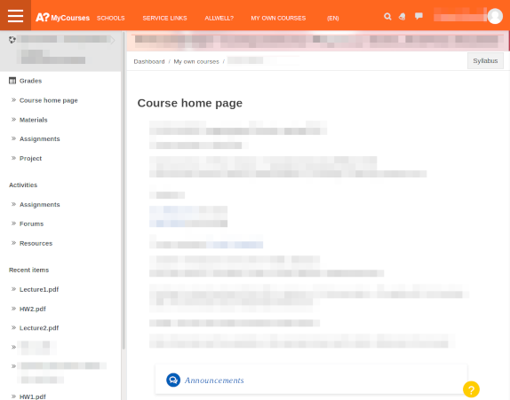

# Vastamyrkky: Tweaks for MyCourses

Vastamyrkky is a browser extension containing a collection of monkey-patches
that allow you to tweak the MyCourses learning environment in use at Aalto
University. This is what the MyCourses dashboard page looks like by default:

And this is what it looks like with all settings enabled in Vastamyrkky:

This is a course page by default:

This is the same course page with Vastamyrkky:

Customizable settings in Vastamyrkky include

- Redirect login page to Aalto login
- Show recent items such as PDFs in the sidebar
- Prevent force download of PDF files
- Make sidebar animation faster or disable it completely

Most of the settings have quite minor effects, but all of them aim to make the
MyCourses experience slightly smoother. The philosophy is to work with what we
have and not redo the whole layout from scratch (although that might be an idea
worth pursuing with MyCourses).

Currently, Vastamyrkky is only available for Firefox, but it shouldn't be too
difficult to port to Chrome.

Any feature may break whenever MyCourses is updated. If you find a bug or have
a feature request, feel free to open an issue or pull request here on GitHub!

Vastamyrkky doesn't store any of your personal information, except for a list
of recently viewed items if you enable it. All information is only read from
the HTML of the page as it is being displayed to you and it is never sent
anywhere.

## Hacking

### Installing development version on Firefox

1. Clone or download the repo
1. Open Firefox, type `about:debugging` into the address bar
1. Click `This Firefox` and `Load Temporary Add-on...` and navigate to the `manifest.json` file in `vastamyrkky/src/firefox/`.
1. Change the extension settings by clicking on the extension icon in the toolbar or going to `about:addons`.

### Adding a new setting

To add a new setting, follow these steps:

1. Add an input (checkbox, drop-down menu etc.) for your setting to the form in `settings.html`.
1. Add your setting and the corresponding query selector to the `browser.storage.sync.set` call in `settings.js`
1. Add your setting to the `browser.storage.sync.get` call and add a corresponding query selector to the `then` block in `settings.js`
1. Add your setting to the `browser.storage.sync.get` call in the script which you want it to be executed (e.g. `dashboard.js` or `coursepage.js`) and implement the logic

### Packaging

To package the extension for release for Firefox, run `make firefox` in the
root directory.
